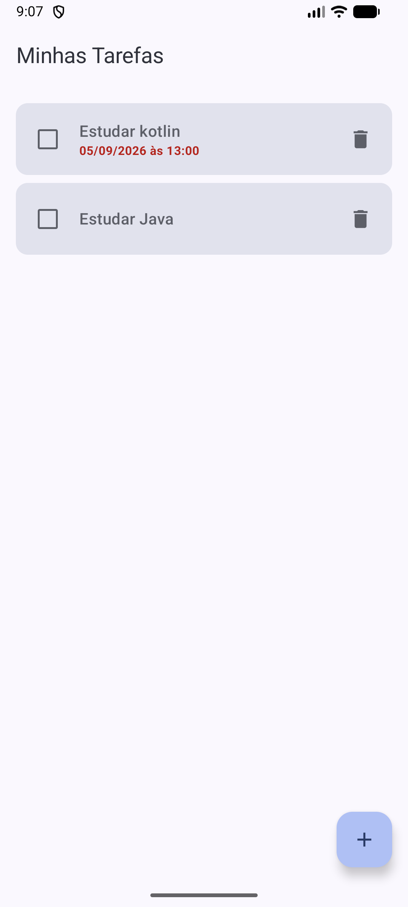
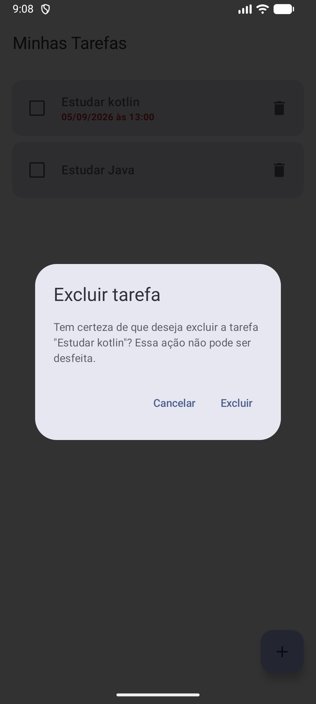
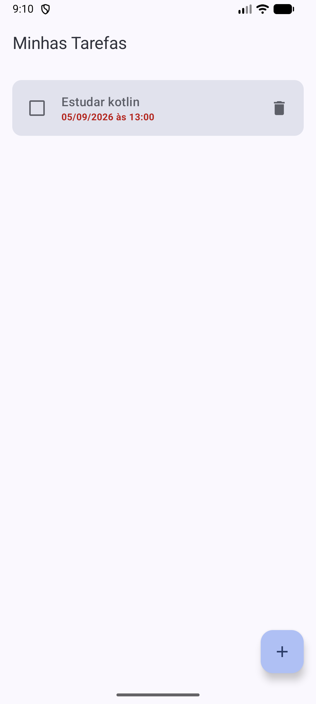

# Evidências — Fluxo de confirmação de exclusão

Este arquivo documenta o comportamento do novo fluxo de exclusão
com diálogo de confirmação (Jetpack Compose Material 3).

## 1. Lista antes da exclusão

Mostra a lista de tarefas com a tarefa que será excluída ainda presente.

<table>
  <tr>
    <td></td>
    <td></td>
  </tr>
</table>

## 2. Resultado ao cancelar e nova abertura

Ao tocar em "Cancelar", o diálogo é fechado e a lista permanece inalterada.
O diálogo é aberto novamente para confirmar que o fluxo pode ser repetido.

<table>
  <tr>
    <td></td>
    <td></td>
  </tr>
</table>

## 3. Resultado após confirmar a exclusão

Ao tocar em "Excluir", somente a tarefa selecionada é removida da lista.

